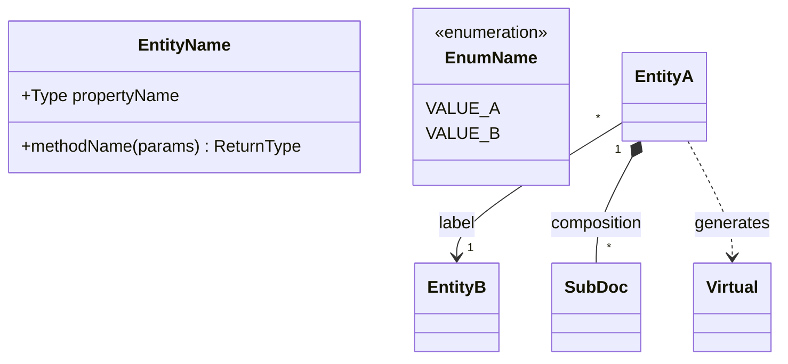
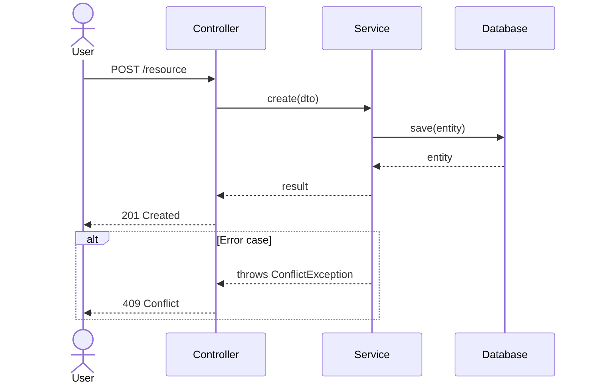
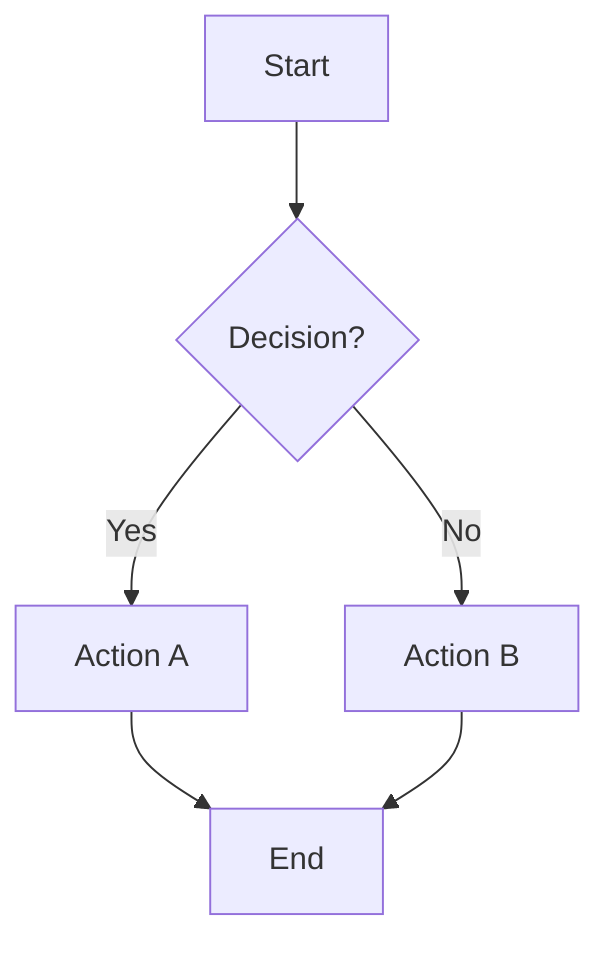
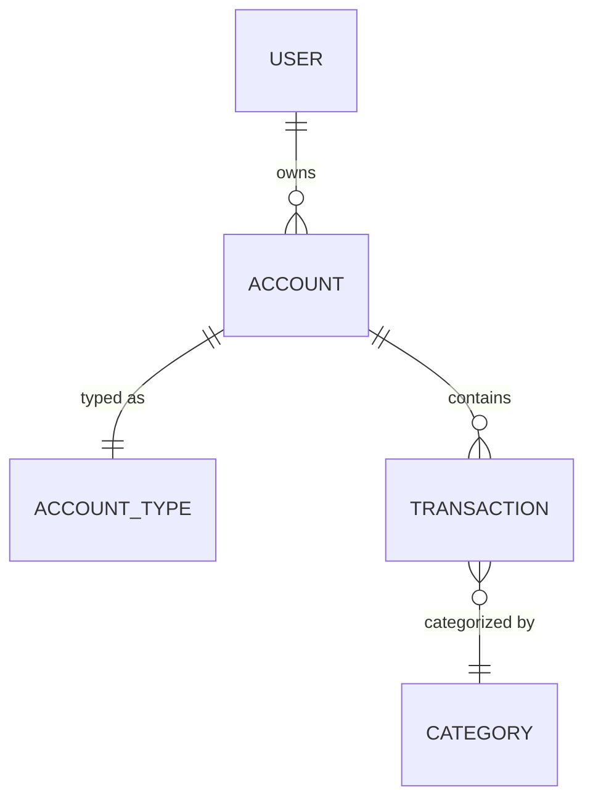
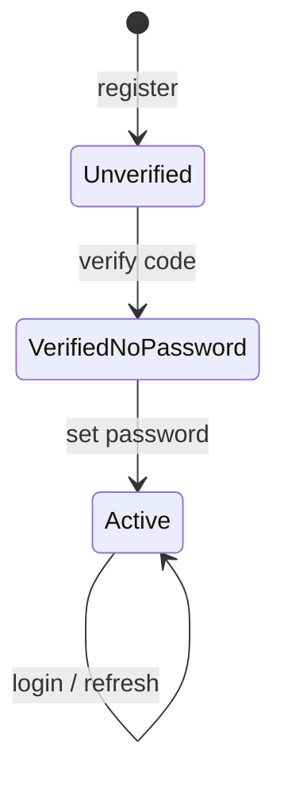

# Budget Mermaid Docs

Create Mermaid diagrams in `budget-api/docs/` to document software architecture and design. The agent invoking this skill provides the context (entities, services, flows) in the prompt — this skill defines how to produce diagrams.

## File Naming

```
budget-api/docs/{diagram-type}.{feature-or-module}.md
```

Examples:
- `class-diagram.identity-module.md`
- `sequence-diagram.registration-flow.md`
- `flowchart.bill-payment.md`
- `er-diagram.workspace-module.md`
- `state-diagram.invitation-lifecycle.md`

## File Structure

Every diagram file follows this template:

```markdown
# {Feature/Module} — {Diagram Type} Diagram

‍```mermaid
{diagramType}

    %% ─────────────────────────────────────────────
    %% Section Name
    %% ─────────────────────────────────────────────

    {diagram content}
‍```
```

Rules:
- Single H1 title: `{Feature/Module} — {Diagram Type} Diagram`
- Single mermaid code block per file
- Use `%%` section separators with the dash style shown above
- 4-space indentation inside the mermaid block
- No prose outside the title and code block

## Diagram Types

### Class Diagram

Use for: entity relationships, data models, module structure.

Section order:
1. Referenced entities from other modules (context, minimal properties)
2. Persisted entities (full properties)
3. Virtual/computed types (marked `<<virtual>>` or `<<interface>>`)
4. Subdocuments (marked `<<subdocument>>`)
5. Enumerations (marked `<<enumeration>>`)
6. Relationships



Relationship notation:
- `-->` association (with cardinality `"1"`, `"*"`, `"0..1"`, `"0..*"`)
- `*--` composition (embedded subdocuments)
- `..>` dependency (virtual/computed)

### Sequence Diagram

Use for: request flows, multi-step processes, service interactions.



Conventions:
- Use `actor` for external users/systems
- Use `participant` for internal components
- `->>` for requests, `-->>` for responses
- Use `alt`/`opt`/`loop`/`break` for control flow
- Group related interactions with `rect` blocks if needed

### Flowchart

Use for: business logic, decision trees, process flows.



Conventions:
- `TD` (top-down) for vertical flows, `LR` (left-right) for horizontal
- `[text]` rectangles for actions
- `{text}` diamonds for decisions
- `([text])` stadiums for start/end
- `[(text)]` cylinders for databases
- Label edges with `-->|label|`

### ER Diagram

Use for: database schema relationships when entity internals matter less than cardinality.



Cardinality: `||` exactly one, `o|` zero or one, `}o` zero or more, `}|` one or more.

### State Diagram

Use for: entity lifecycle, status transitions.



Conventions:
- `[*]` for initial/final states
- Label transitions with the triggering action
- Use `state "Label" as alias` for long state names

## Design Diagrams

When documenting a feature that is being designed (not yet implemented), follow additional conventions:

- Title uses "Design Diagram" instead of just the type name (e.g., `Budgets Module — Design Diagram`)
- Separate existing entities from proposed ones with distinct section headers:
  - `%% Existing entities (context — key properties only)`
  - `%% New entities (proposed)`
- Keep existing entity properties minimal (only what's relevant to the design)

## Guidelines

- One diagram per file — split complex modules into multiple diagrams by type
- Keep diagrams focused — include only entities/flows relevant to the documented feature
- Cross-module references show minimal properties (id, name, and only fields relevant to the relationship)
- Use `String` type for class diagrams (capitalize), matching the existing convention
- Enum values use UPPER_SNAKE_CASE
