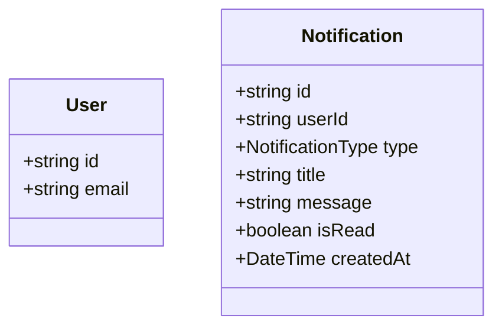

# Design Mode Reference

## Workflow

1. **Understand the requirement** — Gather feature name, domain concepts, constraints, MVP vs full scope
2. **Analyze existing codebase** — Scan entities for patterns, naming conventions, ORM, base classes, shared types
3. **Propose entity design** — New entities, enums, relationships, integration points with existing entities
4. **Generate the diagram** — Merged view of existing (context) + new (proposed) entities
5. **Present with summary** — Explain design decisions, trade-offs, open questions

## Pattern Detection Checklist

When analyzing an existing codebase before designing, check for:

| Pattern | What to Look For | Apply to New Entities |
|---|---|---|
| ID strategy | ObjectId vs UUID vs auto-increment | Use same ID type |
| Timestamps | `createdAt`/`updatedAt` via base class or decorators | Extend same base class |
| Soft deletes | `deletedAt` field or `isDeleted` flag | Include if present |
| User isolation | `user` field on every entity | Add `user` reference |
| Naming | camelCase vs snake_case, singular vs plural | Follow existing convention |
| Enums | Separate files, naming pattern (e.g., `*-type.enum.ts`) | Use same enum style |
| Autopopulate | `autopopulate: true` on references | Include on new references |
| Currency handling | Dedicated field, enum, or embedded type | Follow same approach |

## Existing vs New Entity Differentiation

In the Mermaid diagram, clearly separate existing and new entities:

Rules:
- Existing entities: show only `id` and properties relevant to the new relationships
- New entities: show full property definitions following existing patterns
- Use `%% Existing entities (context)` and `%% New entities (proposed)` comment headers
- Use `-design` suffix in filename (e.g., `class-diagram.notifications-design.md`)

## Design Decision Documentation

After the diagram, provide a brief summary:

1. **Proposed entities** — List each new entity with a one-line description
2. **Key design decisions** — Explain non-obvious choices (e.g., "Separate NotificationPreference entity instead of embedding preferences in User to support per-channel granularity")
3. **Integration points** — List how new entities connect to existing ones
4. **Open questions** — List decisions the user needs to make (e.g., "Should notification history be pruned after 90 days?")

## Combined Mode

When user wants both reverse engineering + design:

1. Run full reverse engineering first → save as `class-diagram.full.md`
2. Run design mode using reverse-engineered output as foundation
3. Design diagram includes merged view: existing (context) + new (proposed)
4. Save design separately → `class-diagram.<feature>-design.md`

## Design Without Codebase

If no codebase is available:
- Ask about ORM choice and conventions
- Use sensible defaults: ObjectId IDs, `createdAt`/`updatedAt` timestamps, user isolation pattern
- Design with plain TypeScript class notation
- Note assumptions clearly in the summary
