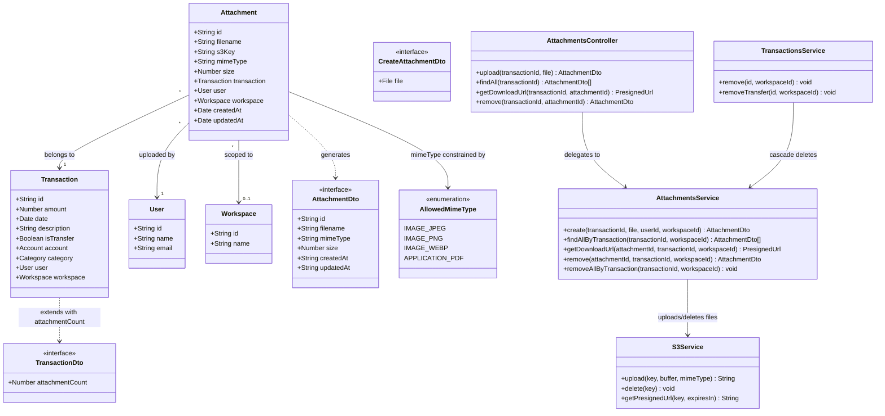

# Attachments Module — Design Class Diagram

```mermaid
classDiagram

    %% ─────────────────────────────────────────────
    %% Existing entities (context — key properties only)
    %% ─────────────────────────────────────────────

    class User {
        +String id
        +String name
        +String email
    }

    class Workspace {
        +String id
        +String name
    }

    class Transaction {
        +String id
        +Number amount
        +Date date
        +String description
        +Boolean isTransfer
        +Account account
        +Category category
        +User user
        +Workspace workspace
    }

    %% ─────────────────────────────────────────────
    %% New entities (proposed)
    %% ─────────────────────────────────────────────

    class Attachment {
        +String id
        +String filename
        +String s3Key
        +String mimeType
        +Number size
        +Transaction transaction
        +User user
        +Workspace workspace
        +Date createdAt
        +Date updatedAt
    }

    %% ─────────────────────────────────────────────
    %% DTOs
    %% ─────────────────────────────────────────────

    class AttachmentDto {
        <<interface>>
        +String id
        +String filename
        +String mimeType
        +Number size
        +String createdAt
        +String updatedAt
    }

    class CreateAttachmentDto {
        <<interface>>
        +File file
    }

    class TransactionDto {
        <<interface>>
        +Number attachmentCount
    }

    %% ─────────────────────────────────────────────
    %% Services
    %% ─────────────────────────────────────────────

    class S3Service {
        +upload(key, buffer, mimeType) String
        +delete(key) void
        +getPresignedUrl(key, expiresIn) String
    }

    class AttachmentsService {
        +create(transactionId, file, userId, workspaceId) AttachmentDto
        +findAllByTransaction(transactionId, workspaceId) AttachmentDto[]
        +getDownloadUrl(attachmentId, transactionId, workspaceId) PresignedUrl
        +remove(attachmentId, transactionId, workspaceId) AttachmentDto
        +removeAllByTransaction(transactionId, workspaceId) void
    }

    class AttachmentsController {
        +upload(transactionId, file) AttachmentDto
        +findAll(transactionId) AttachmentDto[]
        +getDownloadUrl(transactionId, attachmentId) PresignedUrl
        +remove(transactionId, attachmentId) AttachmentDto
    }

    class TransactionsService {
        +remove(id, workspaceId) void
        +removeTransfer(id, workspaceId) void
    }

    %% ─────────────────────────────────────────────
    %% Enumerations
    %% ─────────────────────────────────────────────

    class AllowedMimeType {
        <<enumeration>>
        IMAGE_JPEG
        IMAGE_PNG
        IMAGE_WEBP
        APPLICATION_PDF
    }

    %% ─────────────────────────────────────────────
    %% Relationships
    %% ─────────────────────────────────────────────

    %% Entity references
    Attachment "*" --> "1" Transaction : belongs to
    Attachment "*" --> "1" User : uploaded by
    Attachment "*" --> "0..1" Workspace : scoped to

    %% DTO generation
    Attachment ..> AttachmentDto : generates
    Transaction ..> TransactionDto : extends with attachmentCount

    %% Service dependencies
    AttachmentsController --> AttachmentsService : delegates to
    AttachmentsService --> S3Service : uploads/deletes files
    TransactionsService --> AttachmentsService : cascade deletes

    %% Validation
    Attachment --> AllowedMimeType : mimeType constrained by
```
