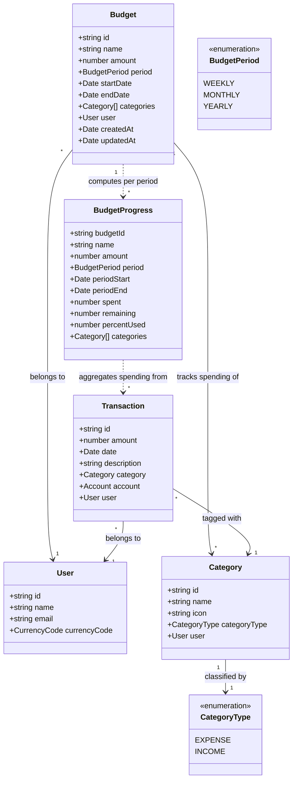

# Budgets Module — Design Diagram

```mermaid
classDiagram

    %% ============================================================
    %% Existing entities (context — key properties only)
    %% ============================================================

    class User {
        +string id
        +string name
        +string email
        +CurrencyCode currencyCode
    }

    class Category {
        +string id
        +string name
        +string icon
        +CategoryType categoryType
        +User user
    }

    class Transaction {
        +string id
        +number amount
        +Date date
        +string description
        +Category category
        +Account account
        +User user
    }

    class CategoryType {
        <<enumeration>>
        EXPENSE
        INCOME
    }

    %% ============================================================
    %% New entities (proposed)
    %% ============================================================

    class Budget {
        +string id
        +string name
        +number amount
        +BudgetPeriod period
        +Date startDate
        +Date endDate
        +Category[] categories
        +User user
        +Date createdAt
        +Date updatedAt
    }

    %% ============================================================
    %% New enumerations
    %% ============================================================

    class BudgetPeriod {
        <<enumeration>>
        WEEKLY
        MONTHLY
        YEARLY
    }

    %% ============================================================
    %% Virtual / computed (not persisted)
    %% ============================================================

    class BudgetProgress {
        +string budgetId
        +string name
        +number amount
        +BudgetPeriod period
        +Date periodStart
        +Date periodEnd
        +number spent
        +number remaining
        +number percentUsed
        +Category[] categories
    }

    %% ============================================================
    %% Relationships
    %% ============================================================

    Budget "1" --> "*" Category : tracks spending of
    Budget "*" --> "1" User : belongs to
    Category "1" --> "1" CategoryType : classified by
    Transaction "*" --> "1" Category : tagged with
    Transaction "*" --> "1" User : belongs to

    Budget "1" ..> "*" BudgetProgress : computes per period
    BudgetProgress ..> "*" Transaction : aggregates spending from
```