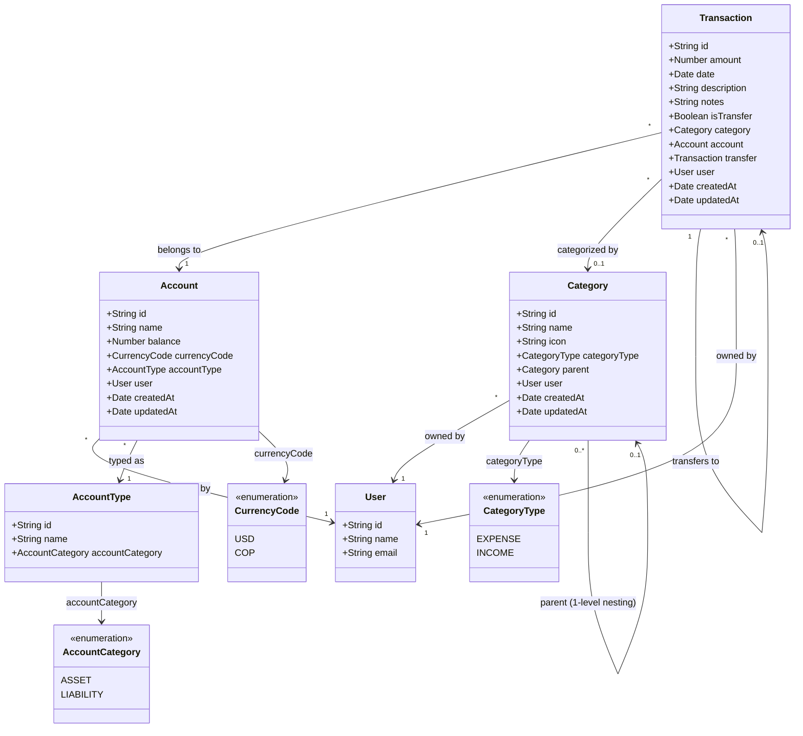

# Financial Module — Class Diagram

```mermaid
classDiagram

    %% ─────────────────────────────────────────────
    %% Referenced Entity (Identity Module — context)
    %% ─────────────────────────────────────────────

    class User {
        +String id
        +String name
        +String email
    }

    %% ─────────────────────────────────────────────
    %% Accounts Module
    %% ─────────────────────────────────────────────

    class Account {
        +String id
        +String name
        +Number balance
        +CurrencyCode currencyCode
        +AccountType accountType
        +User user
        +Date createdAt
        +Date updatedAt
    }

    class AccountType {
        +String id
        +String name
        +AccountCategory accountCategory
    }

    %% ─────────────────────────────────────────────
    %% Transactions Module
    %% ─────────────────────────────────────────────

    class Transaction {
        +String id
        +Number amount
        +Date date
        +String description
        +String notes
        +Boolean isTransfer
        +Category category
        +Account account
        +Transaction transfer
        +User user
        +Date createdAt
        +Date updatedAt
    }

    %% ─────────────────────────────────────────────
    %% Categories Module
    %% ─────────────────────────────────────────────

    class Category {
        +String id
        +String name
        +String icon
        +CategoryType categoryType
        +Category parent
        +User user
        +Date createdAt
        +Date updatedAt
    }

    %% ─────────────────────────────────────────────
    %% Enumerations
    %% ─────────────────────────────────────────────

    class AccountCategory {
        <<enumeration>>
        ASSET
        LIABILITY
    }

    class CategoryType {
        <<enumeration>>
        EXPENSE
        INCOME
    }

    class CurrencyCode {
        <<enumeration>>
        USD
        COP
    }

    %% ─────────────────────────────────────────────
    %% Relationships
    %% ─────────────────────────────────────────────

    %% Accounts
    Account "*" --> "1" User : owned by
    Account "*" --> "1" AccountType : typed as
    Account --> CurrencyCode : currencyCode

    %% Account Types
    AccountType --> AccountCategory : accountCategory

    %% Transactions
    Transaction "*" --> "1" Account : belongs to
    Transaction "*" --> "0..1" Category : categorized by
    Transaction "1" --> "0..1" Transaction : transfers to
    Transaction "*" --> "1" User : owned by

    %% Categories
    Category "*" --> "1" User : owned by
    Category --> CategoryType : categoryType
    Category "0..*" --> "0..1" Category : parent (1-level nesting)
```
