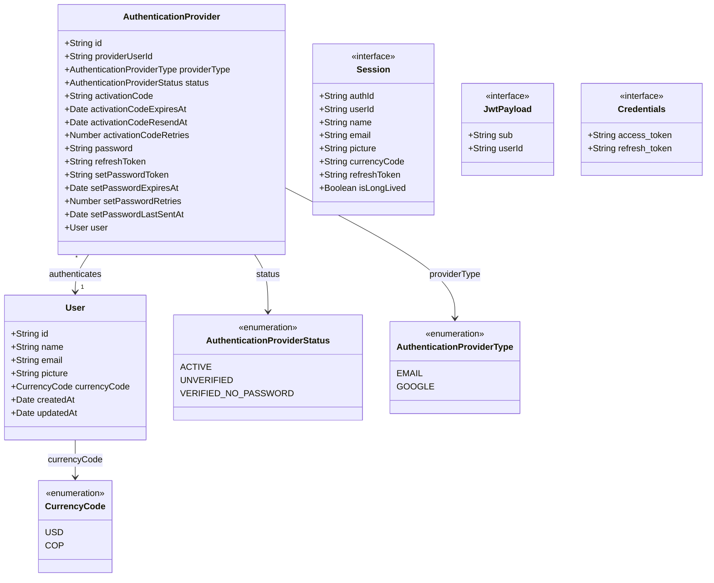

# Identity Module — Class Diagram

```mermaid
classDiagram

    %% ─────────────────────────────────────────────
    %% Identity Module — Persisted Entities
    %% ─────────────────────────────────────────────

    class User {
        +String id
        +String name
        +String email
        +String picture
        +CurrencyCode currencyCode
        +Date createdAt
        +Date updatedAt
    }

    class AuthenticationProvider {
        +String id
        +String providerUserId
        +AuthenticationProviderType providerType
        +AuthenticationProviderStatus status
        +String activationCode
        +Date activationCodeExpiresAt
        +Date activationCodeResendAt
        +Number activationCodeRetries
        +String password
        +String refreshToken
        +String setPasswordToken
        +Date setPasswordExpiresAt
        +Number setPasswordRetries
        +Date setPasswordLastSentAt
        +User user
    }

    %% ─────────────────────────────────────────────
    %% Virtual Types (not persisted)
    %% ─────────────────────────────────────────────

    class Session {
        <<interface>>
        +String authId
        +String userId
        +String name
        +String email
        +String picture
        +String currencyCode
        +String refreshToken
        +Boolean isLongLived
    }

    class JwtPayload {
        <<interface>>
        +String sub
        +String userId
    }

    class Credentials {
        <<interface>>
        +String access_token
        +String refresh_token
    }

    %% ─────────────────────────────────────────────
    %% Enumerations
    %% ─────────────────────────────────────────────

    class AuthenticationProviderStatus {
        <<enumeration>>
        ACTIVE
        UNVERIFIED
        VERIFIED_NO_PASSWORD
    }

    class AuthenticationProviderType {
        <<enumeration>>
        EMAIL
        GOOGLE
    }

    class CurrencyCode {
        <<enumeration>>
        USD
        COP
    }

    %% ─────────────────────────────────────────────
    %% Relationships
    %% ─────────────────────────────────────────────

    AuthenticationProvider "*" --> "1" User : authenticates
    AuthenticationProvider --> AuthenticationProviderType : providerType
    AuthenticationProvider --> AuthenticationProviderStatus : status
    User --> CurrencyCode : currencyCode
```
