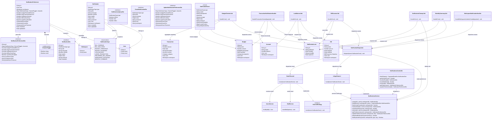

# Notifications Module — Design Class Diagram

```mermaid
classDiagram

    %% ─────────────────────────────────────────────
    %% Existing entities (context — key properties only)
    %% ─────────────────────────────────────────────

    class User {
        +String id
        +String name
        +String email
    }

    class Workspace {
        +String id
        +String name
    }

    class Transaction {
        +String id
        +Number amount
        +Date date
        +String description
        +Account account
        +Category category
        +User user
        +Workspace workspace
    }

    class Bill {
        +String id
        +String name
        +Number amount
        +Date dueDate
        +Date endDate
        +BillFrequency frequency
        +User user
        +Workspace workspace
    }

    class Budget {
        +String id
        +String name
        +Number amount
        +BudgetPeriod period
        +Date startDate
        +Category[] categories
        +User user
        +Workspace workspace
    }

    class Account {
        +String id
        +String name
        +Number balance
        +User user
        +Workspace workspace
    }

    class MailService {
        +sendMail(options) void
    }

    class UsersService {
        +findById(id) User
    }

    %% ─────────────────────────────────────────────
    %% New entities (proposed)
    %% ─────────────────────────────────────────────

    class Notification {
        +String id
        +NotificationType type
        +String title
        +String message
        +Boolean isRead
        +Date readAt
        +Object data
        +String actionUrl
        +User user
        +Workspace workspace
        +Date createdAt
        +Date updatedAt
    }

    class NotificationPreference {
        +String id
        +User user
        +Workspace workspace
        +Map~NotificationType, ChannelToggle~ channels
        +Number budgetThresholdPercent
        +Number largeTransactionAmount
        +Number lowBalanceAmount
        +Number billDueSoonDays
        +Boolean quietHoursEnabled
        +String quietHoursStart
        +String quietHoursEnd
        +String quietHoursTimezone
        +Date createdAt
        +Date updatedAt
    }

    class NotificationLock {
        +String id
        +String jobName
        +Date lockedAt
        +String lockedBy
        +Date expiresAt
    }

    %% ─────────────────────────────────────────────
    %% Subdocuments
    %% ─────────────────────────────────────────────

    class ChannelToggle {
        <<subdocument>>
        +Boolean inApp
        +Boolean email
    }

    %% ─────────────────────────────────────────────
    %% Enumerations
    %% ─────────────────────────────────────────────

    class NotificationType {
        <<enumeration>>
        BILL_OVERDUE
        BILL_DUE_SOON
        BUDGET_THRESHOLD
        BUDGET_EXCEEDED
        LOW_BALANCE
        LARGE_TRANSACTION
        RECURRING_BILL_ENDING
        WORKSPACE_INVITATION
        MONTHLY_SUMMARY
    }

    %% ─────────────────────────────────────────────
    %% DTOs (Input)
    %% ─────────────────────────────────────────────

    class NotificationsQueryDto {
        <<interface>>
        +NotificationType type
        +Boolean isRead
        +Number limit
        +Number offset
    }

    class CreateNotificationDto {
        <<interface>>
        +NotificationType type
        +String title
        +String message
        +Object data
        +String actionUrl
        +String user
        +String workspace
    }

    class UpdateNotificationPreferenceDto {
        <<interface>>
        +Map~NotificationType, ChannelToggle~ channels
        +Number budgetThresholdPercent
        +Number largeTransactionAmount
        +Number lowBalanceAmount
        +Number billDueSoonDays
        +Boolean quietHoursEnabled
        +String quietHoursStart
        +String quietHoursEnd
        +String quietHoursTimezone
    }

    %% ─────────────────────────────────────────────
    %% DTOs (Response)
    %% ─────────────────────────────────────────────

    class NotificationDto {
        <<interface>>
        +String id
        +NotificationType type
        +String title
        +String message
        +Boolean isRead
        +Date readAt
        +Object data
        +String actionUrl
        +Date createdAt
    }

    class NotificationPreferenceDto {
        <<interface>>
        +String id
        +Map~NotificationType, ChannelToggle~ channels
        +Number budgetThresholdPercent
        +Number largeTransactionAmount
        +Number lowBalanceAmount
        +Number billDueSoonDays
        +Boolean quietHoursEnabled
        +String quietHoursStart
        +String quietHoursEnd
        +String quietHoursTimezone
    }

    %% ─────────────────────────────────────────────
    %% Virtual types
    %% ─────────────────────────────────────────────

    class NotificationEvent {
        <<virtual>>
        +NotificationType type
        +String userId
        +String workspaceId
        +String title
        +String message
        +Object data
        +String actionUrl
        +String emailTemplate
        +Object emailContext
        +String deduplicationKey
    }

    %% ─────────────────────────────────────────────
    %% Channel strategies
    %% ─────────────────────────────────────────────

    class ChannelStrategy {
        <<interface>>
        +send(event NotificationEvent) void
    }

    class InAppChannel {
        +send(event NotificationEvent) void
    }

    class EmailChannel {
        +send(event NotificationEvent) void
    }

    %% ─────────────────────────────────────────────
    %% Services
    %% ─────────────────────────────────────────────

    class NotificationsService {
        +create(dto, userId, workspaceId) NotificationDto
        +findAll(userId, workspaceId, query) PaginatedDataDto~NotificationDto~
        +findUnreadCount(userId, workspaceId) Number
        +markAsRead(id, userId, workspaceId) NotificationDto
        +markAllAsRead(userId, workspaceId) Number
        +remove(id, userId, workspaceId) NotificationDto
        +getPreferences(userId, workspaceId) NotificationPreferenceDto
        +updatePreferences(userId, workspaceId, dto) NotificationPreferenceDto
        +deleteOldNotifications(retentionDays) Number
        +findDuplicateKey(userId, workspaceId, type, key) Boolean
    }

    class NotificationDispatcher {
        +dispatch(event NotificationEvent) void
    }

    class NotificationsController {
        +findAll(query) PaginatedDataDto~NotificationDto~
        +getUnreadCount() Number
        +markAsRead(id) NotificationDto
        +markAllAsRead() Number
        +remove(id) NotificationDto
        +getPreferences() NotificationPreferenceDto
        +updatePreferences(dto) NotificationPreferenceDto
    }

    %% ─────────────────────────────────────────────
    %% Event handlers
    %% ─────────────────────────────────────────────

    class TransactionNotificationHandler {
        +handleTransactionCreated(payload) void
    }

    class WorkspaceNotificationHandler {
        +handleWorkspaceInvitationCreated(payload) void
    }

    %% ─────────────────────────────────────────────
    %% Scheduled jobs
    %% ─────────────────────────────────────────────

    class BillScannerJob {
        +handleCron() void
    }

    class BudgetCheckerJob {
        +handleCron() void
    }

    class LowBalanceJob {
        +handleCron() void
    }

    class MonthlySummaryJob {
        +handleCron() void
    }

    class NotificationCleanupJob {
        +handleCron() void
    }

    %% ─────────────────────────────────────────────
    %% Relationships — Entity references
    %% ─────────────────────────────────────────────

    Notification "*" --> "1" User : belongs to
    Notification "*" --> "0..1" Workspace : scoped to
    Notification --> NotificationType : typed as
    NotificationPreference "*" --> "1" User : belongs to
    NotificationPreference "*" --> "0..1" Workspace : scoped to
    NotificationPreference "1" *-- "9" ChannelToggle : channels

    %% ─────────────────────────────────────────────
    %% Relationships — DTO generation
    %% ─────────────────────────────────────────────

    Notification ..> NotificationDto : generates
    NotificationPreference ..> NotificationPreferenceDto : generates

    %% ─────────────────────────────────────────────
    %% Relationships — Channel strategy pattern
    %% ─────────────────────────────────────────────

    InAppChannel ..|> ChannelStrategy : implements
    EmailChannel ..|> ChannelStrategy : implements

    %% ─────────────────────────────────────────────
    %% Relationships — Service dependencies
    %% ─────────────────────────────────────────────

    NotificationsController --> NotificationsService : delegates to
    NotificationDispatcher --> NotificationsService : reads preferences
    NotificationDispatcher --> InAppChannel : dispatches in-app
    NotificationDispatcher --> EmailChannel : dispatches email
    InAppChannel --> NotificationsService : persists notification
    EmailChannel --> MailService : sends email
    EmailChannel --> UsersService : resolves email

    %% ─────────────────────────────────────────────
    %% Relationships — Event handlers
    %% ─────────────────────────────────────────────

    TransactionNotificationHandler --> NotificationDispatcher : dispatches events
    WorkspaceNotificationHandler --> NotificationDispatcher : dispatches events

    %% ─────────────────────────────────────────────
    %% Relationships — Scheduled jobs
    %% ─────────────────────────────────────────────

    BillScannerJob --> NotificationDispatcher : dispatches events
    BillScannerJob --> NotificationLock : acquires lock
    BudgetCheckerJob --> NotificationDispatcher : dispatches events
    BudgetCheckerJob --> NotificationLock : acquires lock
    LowBalanceJob --> NotificationDispatcher : dispatches events
    LowBalanceJob --> NotificationLock : acquires lock
    MonthlySummaryJob --> NotificationDispatcher : dispatches events
    MonthlySummaryJob --> NotificationLock : acquires lock
    NotificationCleanupJob --> NotificationsService : deletes old
    NotificationCleanupJob --> NotificationLock : acquires lock

    %% ─────────────────────────────────────────────
    %% Relationships — Domain data access
    %% ─────────────────────────────────────────────

    BillScannerJob --> Bill : scans bills
    BudgetCheckerJob --> Budget : checks budgets
    BudgetCheckerJob --> Transaction : aggregates spending
    LowBalanceJob --> Account : checks balances
    TransactionNotificationHandler --> Budget : checks thresholds
    TransactionNotificationHandler --> Account : checks balance
```
