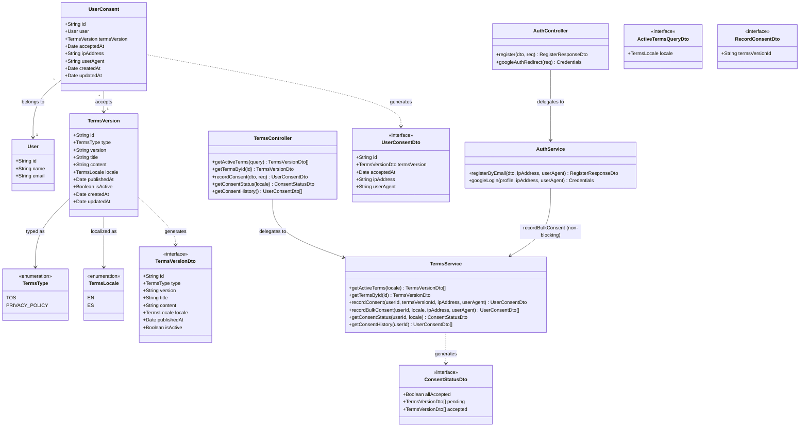

# Terms & Consent Module — Design Class Diagram

```mermaid
classDiagram

    %% ─────────────────────────────────────────────
    %% Existing entities (context — key properties only)
    %% ─────────────────────────────────────────────

    class User {
        +String id
        +String name
        +String email
    }

    class AuthService {
        +registerByEmail(dto, ipAddress, userAgent) RegisterResponseDto
        +googleLogin(profile, ipAddress, userAgent) Credentials
    }

    class AuthController {
        +register(dto, req) RegisterResponseDto
        +googleAuthRedirect(req) Credentials
    }

    %% ─────────────────────────────────────────────
    %% New entities (proposed)
    %% ─────────────────────────────────────────────

    class TermsVersion {
        +String id
        +TermsType type
        +String version
        +String title
        +String content
        +TermsLocale locale
        +Date publishedAt
        +Boolean isActive
        +Date createdAt
        +Date updatedAt
    }

    class UserConsent {
        +String id
        +User user
        +TermsVersion termsVersion
        +Date acceptedAt
        +String ipAddress
        +String userAgent
        +Date createdAt
        +Date updatedAt
    }

    %% ─────────────────────────────────────────────
    %% Enumerations
    %% ─────────────────────────────────────────────

    class TermsType {
        <<enumeration>>
        TOS
        PRIVACY_POLICY
    }

    class TermsLocale {
        <<enumeration>>
        EN
        ES
    }

    %% ─────────────────────────────────────────────
    %% DTOs (Input)
    %% ─────────────────────────────────────────────

    class ActiveTermsQueryDto {
        <<interface>>
        +TermsLocale locale
    }

    class RecordConsentDto {
        <<interface>>
        +String termsVersionId
    }

    %% ─────────────────────────────────────────────
    %% DTOs (Response)
    %% ─────────────────────────────────────────────

    class TermsVersionDto {
        <<interface>>
        +String id
        +TermsType type
        +String version
        +String title
        +String content
        +TermsLocale locale
        +Date publishedAt
        +Boolean isActive
    }

    class UserConsentDto {
        <<interface>>
        +String id
        +TermsVersionDto termsVersion
        +Date acceptedAt
        +String ipAddress
        +String userAgent
    }

    class ConsentStatusDto {
        <<interface>>
        +Boolean allAccepted
        +TermsVersionDto[] pending
        +TermsVersionDto[] accepted
    }

    %% ─────────────────────────────────────────────
    %% Services
    %% ─────────────────────────────────────────────

    class TermsService {
        +getActiveTerms(locale) TermsVersionDto[]
        +getTermsById(id) TermsVersionDto
        +recordConsent(userId, termsVersionId, ipAddress, userAgent) UserConsentDto
        +recordBulkConsent(userId, locale, ipAddress, userAgent) UserConsentDto[]
        +getConsentStatus(userId, locale) ConsentStatusDto
        +getConsentHistory(userId) UserConsentDto[]
    }

    class TermsController {
        +getActiveTerms(query) TermsVersionDto[]
        +getTermsById(id) TermsVersionDto
        +recordConsent(dto, req) UserConsentDto
        +getConsentStatus(locale) ConsentStatusDto
        +getConsentHistory() UserConsentDto[]
    }

    %% ─────────────────────────────────────────────
    %% Relationships — Entity references
    %% ─────────────────────────────────────────────

    UserConsent "*" --> "1" User : belongs to
    UserConsent "*" --> "1" TermsVersion : accepts
    TermsVersion --> TermsType : typed as
    TermsVersion --> TermsLocale : localized as

    %% ─────────────────────────────────────────────
    %% Relationships — DTO generation
    %% ─────────────────────────────────────────────

    TermsVersion ..> TermsVersionDto : generates
    UserConsent ..> UserConsentDto : generates
    TermsService ..> ConsentStatusDto : generates

    %% ─────────────────────────────────────────────
    %% Relationships — Service dependencies
    %% ─────────────────────────────────────────────

    TermsController --> TermsService : delegates to
    AuthService --> TermsService : recordBulkConsent (non-blocking)
    AuthController --> AuthService : delegates to
```
