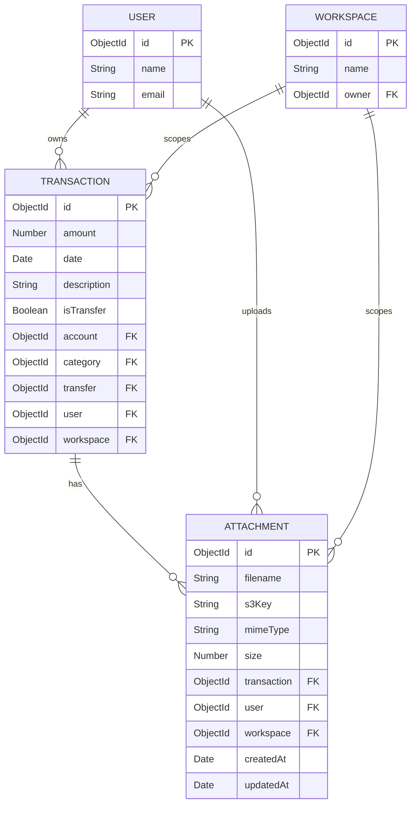

# Attachments Module — Design ER Diagram

```mermaid
erDiagram

    %% ─────────────────────────────────────────────
    %% Existing collections (context)
    %% ─────────────────────────────────────────────

    USER {
        ObjectId id PK
        String name
        String email
    }

    WORKSPACE {
        ObjectId id PK
        String name
        ObjectId owner FK
    }

    TRANSACTION {
        ObjectId id PK
        Number amount
        Date date
        String description
        Boolean isTransfer
        ObjectId account FK
        ObjectId category FK
        ObjectId transfer FK
        ObjectId user FK
        ObjectId workspace FK
    }

    %% ─────────────────────────────────────────────
    %% New collection (proposed)
    %% ─────────────────────────────────────────────

    ATTACHMENT {
        ObjectId id PK
        String filename
        String s3Key
        String mimeType
        Number size
        ObjectId transaction FK
        ObjectId user FK
        ObjectId workspace FK
        Date createdAt
        Date updatedAt
    }

    %% ─────────────────────────────────────────────
    %% Relationships
    %% ─────────────────────────────────────────────

    TRANSACTION ||--o{ ATTACHMENT : "has"
    USER ||--o{ ATTACHMENT : "uploads"
    WORKSPACE ||--o{ ATTACHMENT : "scopes"
    USER ||--o{ TRANSACTION : "owns"
    WORKSPACE ||--o{ TRANSACTION : "scopes"
```
