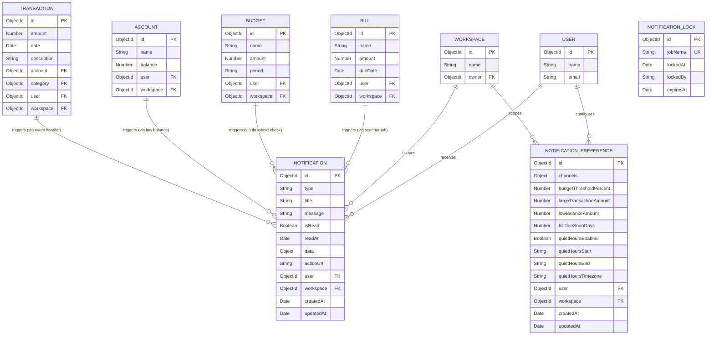

# Notifications Module — Design ER Diagram

```mermaid
erDiagram

    %% ─────────────────────────────────────────────
    %% Existing collections (context)
    %% ─────────────────────────────────────────────

    USER {
        ObjectId id PK
        String name
        String email
    }

    WORKSPACE {
        ObjectId id PK
        String name
        ObjectId owner FK
    }

    BILL {
        ObjectId id PK
        String name
        Number amount
        Date dueDate
        ObjectId user FK
        ObjectId workspace FK
    }

    BUDGET {
        ObjectId id PK
        String name
        Number amount
        String period
        ObjectId user FK
        ObjectId workspace FK
    }

    ACCOUNT {
        ObjectId id PK
        String name
        Number balance
        ObjectId user FK
        ObjectId workspace FK
    }

    TRANSACTION {
        ObjectId id PK
        Number amount
        Date date
        String description
        ObjectId account FK
        ObjectId category FK
        ObjectId user FK
        ObjectId workspace FK
    }

    %% ─────────────────────────────────────────────
    %% New collections (proposed)
    %% ─────────────────────────────────────────────

    NOTIFICATION {
        ObjectId id PK
        String type
        String title
        String message
        Boolean isRead
        Date readAt
        Object data
        String actionUrl
        ObjectId user FK
        ObjectId workspace FK
        Date createdAt
        Date updatedAt
    }

    NOTIFICATION_PREFERENCE {
        ObjectId id PK
        Object channels
        Number budgetThresholdPercent
        Number largeTransactionAmount
        Number lowBalanceAmount
        Number billDueSoonDays
        Boolean quietHoursEnabled
        String quietHoursStart
        String quietHoursEnd
        String quietHoursTimezone
        ObjectId user FK
        ObjectId workspace FK
        Date createdAt
        Date updatedAt
    }

    NOTIFICATION_LOCK {
        ObjectId id PK
        String jobName UK
        Date lockedAt
        String lockedBy
        Date expiresAt
    }

    %% ─────────────────────────────────────────────
    %% Relationships
    %% ─────────────────────────────────────────────

    USER ||--o{ NOTIFICATION : "receives"
    WORKSPACE ||--o{ NOTIFICATION : "scopes"
    USER ||--o{ NOTIFICATION_PREFERENCE : "configures"
    WORKSPACE ||--o{ NOTIFICATION_PREFERENCE : "scopes"

    BILL ||--o{ NOTIFICATION : "triggers (via scanner job)"
    BUDGET ||--o{ NOTIFICATION : "triggers (via threshold check)"
    ACCOUNT ||--o{ NOTIFICATION : "triggers (via low balance)"
    TRANSACTION ||--o{ NOTIFICATION : "triggers (via event handler)"
```
