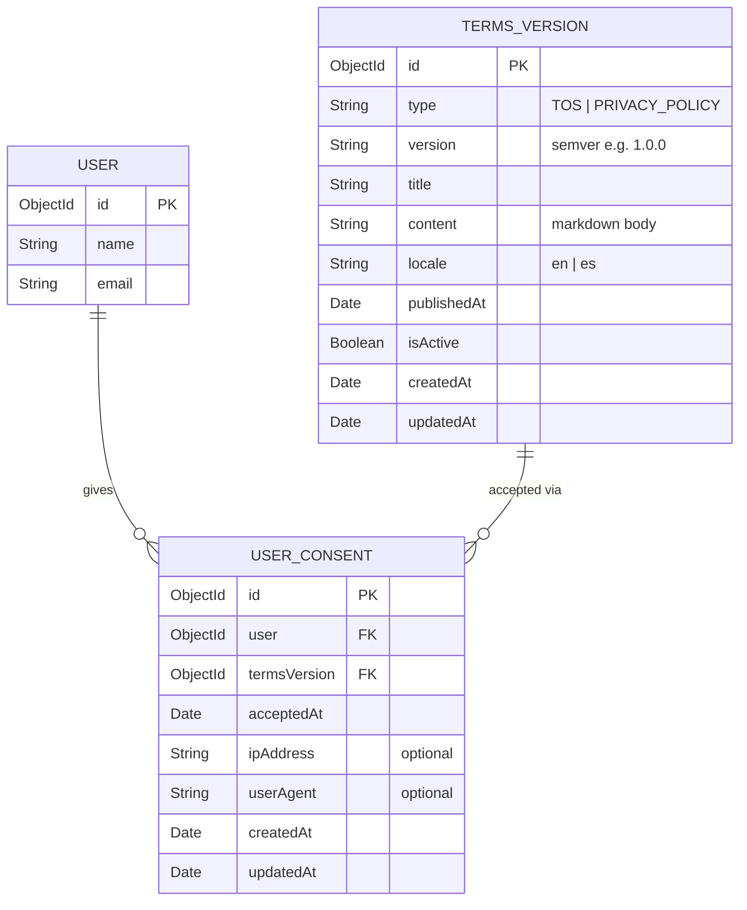

# Terms & Consent Module — Design ER Diagram

```mermaid
erDiagram

    %% ─────────────────────────────────────────────
    %% Existing collections (context)
    %% ─────────────────────────────────────────────

    USER {
        ObjectId id PK
        String name
        String email
    }

    %% ─────────────────────────────────────────────
    %% New collections (proposed)
    %% ─────────────────────────────────────────────

    TERMS_VERSION {
        ObjectId id PK
        String type "TOS | PRIVACY_POLICY"
        String version "semver e.g. 1.0.0"
        String title
        String content "markdown body"
        String locale "en | es"
        Date publishedAt
        Boolean isActive
        Date createdAt
        Date updatedAt
    }

    USER_CONSENT {
        ObjectId id PK
        ObjectId user FK
        ObjectId termsVersion FK
        Date acceptedAt
        String ipAddress "optional"
        String userAgent "optional"
        Date createdAt
        Date updatedAt
    }

    %% ─────────────────────────────────────────────
    %% Relationships
    %% ─────────────────────────────────────────────

    USER ||--o{ USER_CONSENT : "gives"
    TERMS_VERSION ||--o{ USER_CONSENT : "accepted via"
```
