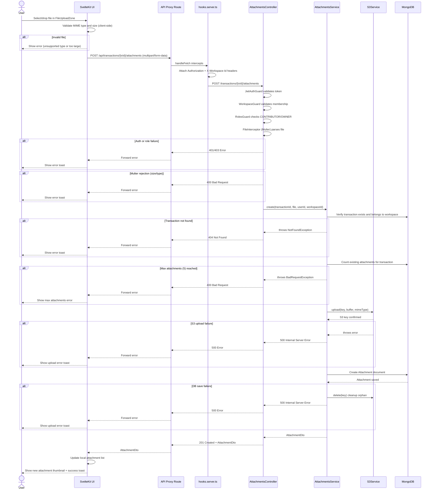

# Attachment Upload Flow — Design Sequence Diagram

```mermaid
sequenceDiagram
    actor User
    participant UI as SvelteKit UI
    participant Proxy as API Proxy Route
    participant Hooks as hooks.server.ts
    participant Controller as AttachmentsController
    participant Service as AttachmentsService
    participant S3 as S3Service
    participant DB as MongoDB

    %% ─────────────────────────────────────────────
    %% File Selection & Client Validation
    %% ─────────────────────────────────────────────

    User ->> UI: Select/drop file in FileUploadZone
    UI ->> UI: Validate MIME type and size (client-side)

    alt Invalid file
        UI -->> User: Show error (unsupported type or too large)
    end

    %% ─────────────────────────────────────────────
    %% Upload Request
    %% ─────────────────────────────────────────────

    UI ->> Proxy: POST /api/transactions/{txId}/attachments (multipart/form-data)
    Proxy ->> Hooks: handleFetch intercepts
    Hooks ->> Hooks: Attach Authorization + X-Workspace-Id headers
    Hooks ->> Controller: POST /transactions/{txId}/attachments

    %% ─────────────────────────────────────────────
    %% Auth & Multer Processing
    %% ─────────────────────────────────────────────

    Controller ->> Controller: JwtAuthGuard validates token
    Controller ->> Controller: WorkspaceGuard validates membership
    Controller ->> Controller: RolesGuard checks CONTRIBUTOR/OWNER
    Controller ->> Controller: FileInterceptor (Multer) parses file

    alt Auth or role failure
        Controller -->> Proxy: 401/403 Error
        Proxy -->> UI: Forward error
        UI -->> User: Show error toast
    end

    alt Multer rejection (size/type)
        Controller -->> Proxy: 400 Bad Request
        Proxy -->> UI: Forward error
        UI -->> User: Show error toast
    end

    %% ─────────────────────────────────────────────
    %% Service Processing
    %% ─────────────────────────────────────────────

    Controller ->> Service: create(transactionId, file, userId, workspaceId)

    Service ->> DB: Verify transaction exists and belongs to workspace
    alt Transaction not found
        Service -->> Controller: throws NotFoundException
        Controller -->> Proxy: 404 Not Found
        Proxy -->> UI: Forward error
        UI -->> User: Show error toast
    end

    Service ->> DB: Count existing attachments for transaction
    alt Max attachments (5) reached
        Service -->> Controller: throws BadRequestException
        Controller -->> Proxy: 400 Bad Request
        Proxy -->> UI: Forward error
        UI -->> User: Show max attachments error
    end

    %% ─────────────────────────────────────────────
    %% S3 Upload & DB Persist
    %% ─────────────────────────────────────────────

    Service ->> S3: upload(key, buffer, mimeType)
    S3 -->> Service: S3 key confirmed

    alt S3 upload failure
        S3 -->> Service: throws error
        Service -->> Controller: 500 Internal Server Error
        Controller -->> Proxy: 500 Error
        Proxy -->> UI: Forward error
        UI -->> User: Show upload error toast
    end

    Service ->> DB: Create Attachment document
    DB -->> Service: Attachment saved

    alt DB save failure
        Service ->> S3: delete(key) cleanup orphan
        Service -->> Controller: 500 Internal Server Error
        Controller -->> Proxy: 500 Error
        Proxy -->> UI: Forward error
        UI -->> User: Show upload error toast
    end

    %% ─────────────────────────────────────────────
    %% Success Response
    %% ─────────────────────────────────────────────

    Service -->> Controller: AttachmentDto
    Controller -->> Proxy: 201 Created + AttachmentDto
    Proxy -->> UI: AttachmentDto
    UI ->> UI: Update local attachment list
    UI -->> User: Show new attachment thumbnail + success toast
```
