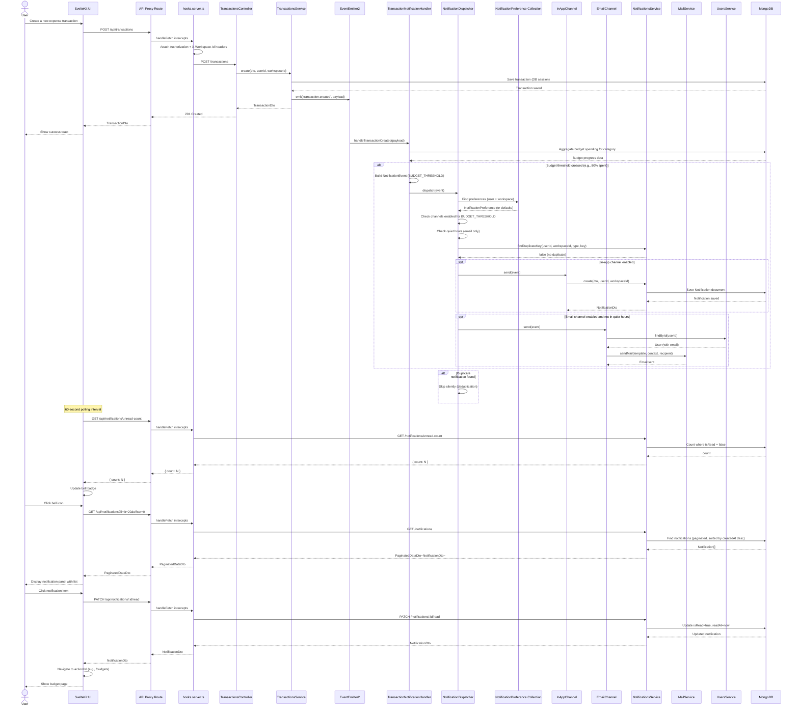

# Notification System — Design Sequence Diagram

```mermaid
sequenceDiagram
    actor User
    participant UI as SvelteKit UI
    participant Proxy as API Proxy Route
    participant Hooks as hooks.server.ts
    participant TxCtrl as TransactionsController
    participant TxSvc as TransactionsService
    participant EventBus as EventEmitter2
    participant TxHandler as TransactionNotificationHandler
    participant Dispatcher as NotificationDispatcher
    participant PrefDB as NotificationPreference Collection
    participant InApp as InAppChannel
    participant Email as EmailChannel
    participant NotifSvc as NotificationsService
    participant MailSvc as MailService
    participant UsersSvc as UsersService
    participant DB as MongoDB

    %% ─────────────────────────────────────────────
    %% Transaction creation triggers notification
    %% ─────────────────────────────────────────────

    User ->> UI: Create a new expense transaction
    UI ->> Proxy: POST /api/transactions
    Proxy ->> Hooks: handleFetch intercepts
    Hooks ->> Hooks: Attach Authorization + X-Workspace-Id headers
    Hooks ->> TxCtrl: POST /transactions
    TxCtrl ->> TxSvc: create(dto, userId, workspaceId)
    TxSvc ->> DB: Save transaction (DB session)
    DB -->> TxSvc: Transaction saved

    %% ─────────────────────────────────────────────
    %% Domain event emission (fire-and-forget)
    %% ─────────────────────────────────────────────

    TxSvc ->> EventBus: emit('transaction.created', payload)
    TxSvc -->> TxCtrl: TransactionDto
    TxCtrl -->> Proxy: 201 Created
    Proxy -->> UI: TransactionDto
    UI -->> User: Show success toast

    %% ─────────────────────────────────────────────
    %% Event handler processing (async)
    %% ─────────────────────────────────────────────

    EventBus ->> TxHandler: handleTransactionCreated(payload)
    TxHandler ->> DB: Aggregate budget spending for category
    DB -->> TxHandler: Budget progress data

    alt Budget threshold crossed (e.g., 80% spent)
        TxHandler ->> TxHandler: Build NotificationEvent (BUDGET_THRESHOLD)
        TxHandler ->> Dispatcher: dispatch(event)

        %% ─────────────────────────────────────────────
        %% Dispatcher: preference resolution & routing
        %% ─────────────────────────────────────────────

        Dispatcher ->> PrefDB: Find preferences (user + workspace)
        PrefDB -->> Dispatcher: NotificationPreference (or defaults)

        Dispatcher ->> Dispatcher: Check channels enabled for BUDGET_THRESHOLD
        Dispatcher ->> Dispatcher: Check quiet hours (email only)
        Dispatcher ->> NotifSvc: findDuplicateKey(userId, workspaceId, type, key)
        NotifSvc -->> Dispatcher: false (no duplicate)

        %% ─────────────────────────────────────────────
        %% Channel delivery: in-app
        %% ─────────────────────────────────────────────

        opt In-app channel enabled
            Dispatcher ->> InApp: send(event)
            InApp ->> NotifSvc: create(dto, userId, workspaceId)
            NotifSvc ->> DB: Save Notification document
            DB -->> NotifSvc: Notification saved
            NotifSvc -->> InApp: NotificationDto
        end

        %% ─────────────────────────────────────────────
        %% Channel delivery: email
        %% ─────────────────────────────────────────────

        opt Email channel enabled and not in quiet hours
            Dispatcher ->> Email: send(event)
            Email ->> UsersSvc: findById(userId)
            UsersSvc -->> Email: User (with email)
            Email ->> MailSvc: sendMail(template, context, recipient)
            MailSvc -->> Email: Email sent
        end
    end

    alt Duplicate notification found
        Dispatcher ->> Dispatcher: Skip silently (deduplication)
    end

    %% ─────────────────────────────────────────────
    %% UI polling picks up new notification
    %% ─────────────────────────────────────────────

    Note over UI: 60-second polling interval
    UI ->> Proxy: GET /api/notifications/unread-count
    Proxy ->> Hooks: handleFetch intercepts
    Hooks ->> NotifSvc: GET /notifications/unread-count
    NotifSvc ->> DB: Count where isRead = false
    DB -->> NotifSvc: count
    NotifSvc -->> Hooks: { count: N }
    Hooks -->> Proxy: { count: N }
    Proxy -->> UI: { count: N }
    UI ->> UI: Update bell badge

    %% ─────────────────────────────────────────────
    %% User opens notification panel
    %% ─────────────────────────────────────────────

    User ->> UI: Click bell icon
    UI ->> Proxy: GET /api/notifications?limit=20&offset=0
    Proxy ->> Hooks: handleFetch intercepts
    Hooks ->> NotifSvc: GET /notifications
    NotifSvc ->> DB: Find notifications (paginated, sorted by createdAt desc)
    DB -->> NotifSvc: Notification[]
    NotifSvc -->> Hooks: PaginatedDataDto~NotificationDto~
    Hooks -->> Proxy: PaginatedDataDto
    Proxy -->> UI: PaginatedDataDto
    UI -->> User: Display notification panel with list

    %% ─────────────────────────────────────────────
    %% User interacts with notification
    %% ─────────────────────────────────────────────

    User ->> UI: Click notification item
    UI ->> Proxy: PATCH /api/notifications/:id/read
    Proxy ->> Hooks: handleFetch intercepts
    Hooks ->> NotifSvc: PATCH /notifications/:id/read
    NotifSvc ->> DB: Update isRead=true, readAt=now
    DB -->> NotifSvc: Updated notification
    NotifSvc -->> Hooks: NotificationDto
    Hooks -->> Proxy: NotificationDto
    Proxy -->> UI: NotificationDto
    UI ->> UI: Navigate to actionUrl (e.g., /budgets)
    UI -->> User: Show budget page
```
