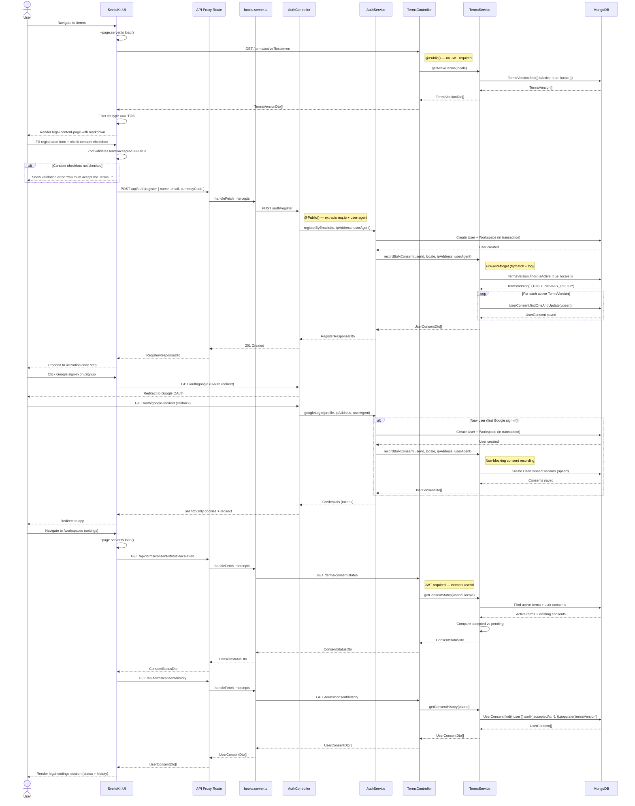

# Terms & Consent — Design Sequence Diagram

```mermaid
sequenceDiagram
    actor User
    participant UI as SvelteKit UI
    participant Proxy as API Proxy Route
    participant Hooks as hooks.server.ts
    participant AuthCtrl as AuthController
    participant AuthSvc as AuthService
    participant TermsCtrl as TermsController
    participant TermsSvc as TermsService
    participant DB as MongoDB

    %% ─────────────────────────────────────────────
    %% User views Terms of Service page
    %% ─────────────────────────────────────────────

    User ->> UI: Navigate to /terms
    UI ->> UI: +page.server.ts load()
    UI ->> TermsCtrl: GET /terms/active?locale=en
    Note right of TermsCtrl: @Public() — no JWT required
    TermsCtrl ->> TermsSvc: getActiveTerms(locale)
    TermsSvc ->> DB: TermsVersion.find({ isActive: true, locale })
    DB -->> TermsSvc: TermsVersion[]
    TermsSvc -->> TermsCtrl: TermsVersionDto[]
    TermsCtrl -->> UI: TermsVersionDto[]
    UI ->> UI: Filter for type === 'TOS'
    UI -->> User: Render legal-content-page with markdown

    %% ─────────────────────────────────────────────
    %% Registration with consent gate
    %% ─────────────────────────────────────────────

    User ->> UI: Fill registration form + check consent checkbox
    UI ->> UI: Zod validates termsAccepted === true

    alt Consent checkbox not checked
        UI -->> User: Show validation error "You must accept the Terms..."
    end

    UI ->> Proxy: POST /api/auth/register { name, email, currencyCode }
    Proxy ->> Hooks: handleFetch intercepts
    Hooks ->> AuthCtrl: POST /auth/register
    Note right of AuthCtrl: @Public() — extracts req.ip + user-agent
    AuthCtrl ->> AuthSvc: registerByEmail(dto, ipAddress, userAgent)
    AuthSvc ->> DB: Create User + Workspace (in transaction)
    DB -->> AuthSvc: User created

    %% ─────────────────────────────────────────────
    %% Bulk consent recording (non-blocking)
    %% ─────────────────────────────────────────────

    AuthSvc ->> TermsSvc: recordBulkConsent(userId, locale, ipAddress, userAgent)
    Note right of TermsSvc: Fire-and-forget (try/catch + log)
    TermsSvc ->> DB: TermsVersion.find({ isActive: true, locale })
    DB -->> TermsSvc: TermsVersion[] (TOS + PRIVACY_POLICY)

    loop For each active TermsVersion
        TermsSvc ->> DB: UserConsent.findOneAndUpdate(upsert)
        DB -->> TermsSvc: UserConsent saved
    end

    TermsSvc -->> AuthSvc: UserConsentDto[]
    AuthSvc -->> AuthCtrl: RegisterResponseDto
    AuthCtrl -->> Proxy: 201 Created
    Proxy -->> UI: RegisterResponseDto
    UI -->> User: Proceed to activation code step

    %% ─────────────────────────────────────────────
    %% Google OAuth registration with implicit consent
    %% ─────────────────────────────────────────────

    User ->> UI: Click Google sign-in on /signup
    UI ->> AuthCtrl: GET /auth/google (OAuth redirect)
    AuthCtrl -->> User: Redirect to Google OAuth
    User ->> AuthCtrl: GET /auth/google-redirect (callback)
    AuthCtrl ->> AuthSvc: googleLogin(profile, ipAddress, userAgent)

    alt New user (first Google sign-in)
        AuthSvc ->> DB: Create User + Workspace (in transaction)
        DB -->> AuthSvc: User created
        AuthSvc ->> TermsSvc: recordBulkConsent(userId, locale, ipAddress, userAgent)
        Note right of TermsSvc: Non-blocking consent recording
        TermsSvc ->> DB: Create UserConsent records (upsert)
        DB -->> TermsSvc: Consents saved
        TermsSvc -->> AuthSvc: UserConsentDto[]
    end

    AuthSvc -->> AuthCtrl: Credentials (tokens)
    AuthCtrl -->> UI: Set httpOnly cookies + redirect
    UI -->> User: Redirect to app

    %% ─────────────────────────────────────────────
    %% Settings page — consent status and history
    %% ─────────────────────────────────────────────

    User ->> UI: Navigate to /workspaces (settings)
    UI ->> UI: +page.server.ts load()
    UI ->> Proxy: GET /api/terms/consent/status?locale=en
    Proxy ->> Hooks: handleFetch intercepts
    Hooks ->> TermsCtrl: GET /terms/consent/status
    Note right of TermsCtrl: JWT required — extracts userId
    TermsCtrl ->> TermsSvc: getConsentStatus(userId, locale)
    TermsSvc ->> DB: Find active terms + user consents
    DB -->> TermsSvc: Active terms + existing consents
    TermsSvc ->> TermsSvc: Compare accepted vs pending
    TermsSvc -->> TermsCtrl: ConsentStatusDto
    TermsCtrl -->> Hooks: ConsentStatusDto
    Hooks -->> Proxy: ConsentStatusDto
    Proxy -->> UI: ConsentStatusDto

    UI ->> Proxy: GET /api/terms/consent/history
    Proxy ->> Hooks: handleFetch intercepts
    Hooks ->> TermsCtrl: GET /terms/consent/history
    TermsCtrl ->> TermsSvc: getConsentHistory(userId)
    TermsSvc ->> DB: UserConsent.find({ user }).sort({ acceptedAt: -1 }).populate('termsVersion')
    DB -->> TermsSvc: UserConsent[]
    TermsSvc -->> TermsCtrl: UserConsentDto[]
    TermsCtrl -->> Hooks: UserConsentDto[]
    Hooks -->> Proxy: UserConsentDto[]
    Proxy -->> UI: UserConsentDto[]

    UI -->> User: Render legal-settings-section (status + history)
```
