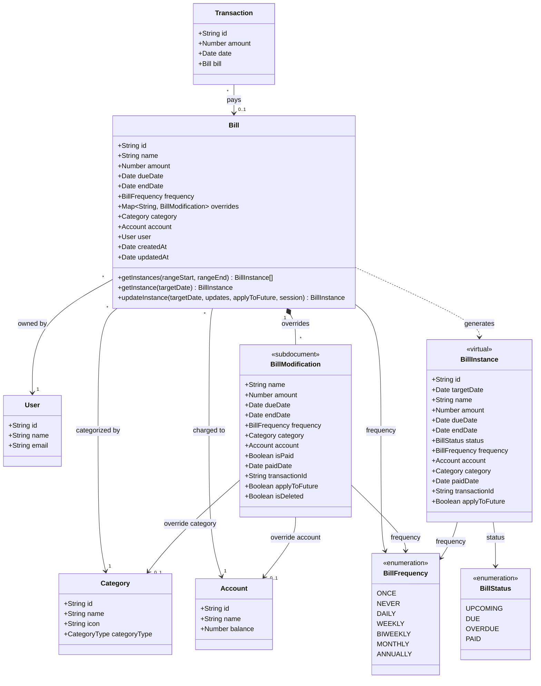

# Billing Module — Class Diagram

```mermaid
classDiagram

    %% ─────────────────────────────────────────────
    %% Referenced Entities (context — minimal properties)
    %% ─────────────────────────────────────────────

    class User {
        +String id
        +String name
        +String email
    }

    class Account {
        +String id
        +String name
        +Number balance
    }

    class Category {
        +String id
        +String name
        +String icon
        +CategoryType categoryType
    }

    class Transaction {
        +String id
        +Number amount
        +Date date
        +Bill bill
    }

    %% ─────────────────────────────────────────────
    %% Bills Module — Persisted Entities
    %% ─────────────────────────────────────────────

    class Bill {
        +String id
        +String name
        +Number amount
        +Date dueDate
        +Date endDate
        +BillFrequency frequency
        +Map~String, BillModification~ overrides
        +Category category
        +Account account
        +User user
        +Date createdAt
        +Date updatedAt
        +getInstances(rangeStart, rangeEnd) BillInstance[]
        +getInstance(targetDate) BillInstance
        +updateInstance(targetDate, updates, applyToFuture, session) BillInstance
    }

    class BillModification {
        <<subdocument>>
        +String name
        +Number amount
        +Date dueDate
        +Date endDate
        +BillFrequency frequency
        +Category category
        +Account account
        +Boolean isPaid
        +Date paidDate
        +String transactionId
        +Boolean applyToFuture
        +Boolean isDeleted
    }

    %% ─────────────────────────────────────────────
    %% Virtual (not persisted — generated on-the-fly)
    %% ─────────────────────────────────────────────

    class BillInstance {
        <<virtual>>
        +String id
        +Date targetDate
        +String name
        +Number amount
        +Date dueDate
        +Date endDate
        +BillStatus status
        +BillFrequency frequency
        +Account account
        +Category category
        +Date paidDate
        +String transactionId
        +Boolean applyToFuture
    }

    %% ─────────────────────────────────────────────
    %% Enumerations
    %% ─────────────────────────────────────────────

    class BillFrequency {
        <<enumeration>>
        ONCE
        NEVER
        DAILY
        WEEKLY
        BIWEEKLY
        MONTHLY
        ANNUALLY
    }

    class BillStatus {
        <<enumeration>>
        UPCOMING
        DUE
        OVERDUE
        PAID
    }

    %% ─────────────────────────────────────────────
    %% Relationships
    %% ─────────────────────────────────────────────

    %% Bill core relationships
    Bill "*" --> "1" User : owned by
    Bill "*" --> "1" Category : categorized by
    Bill "*" --> "1" Account : charged to
    Bill --> BillFrequency : frequency

    %% Bill ↔ BillModification (embedded subdocument map)
    Bill "1" *-- "*" BillModification : overrides

    %% Bill generates virtual instances
    Bill ..> BillInstance : generates

    %% BillModification overrides
    BillModification --> "0..1" Category : override category
    BillModification --> "0..1" Account : override account
    BillModification --> BillFrequency : frequency

    %% BillInstance computed properties
    BillInstance --> BillStatus : status
    BillInstance --> BillFrequency : frequency

    %% Cross-module: Transaction pays a bill
    Transaction "*" --> "0..1" Bill : pays
```
